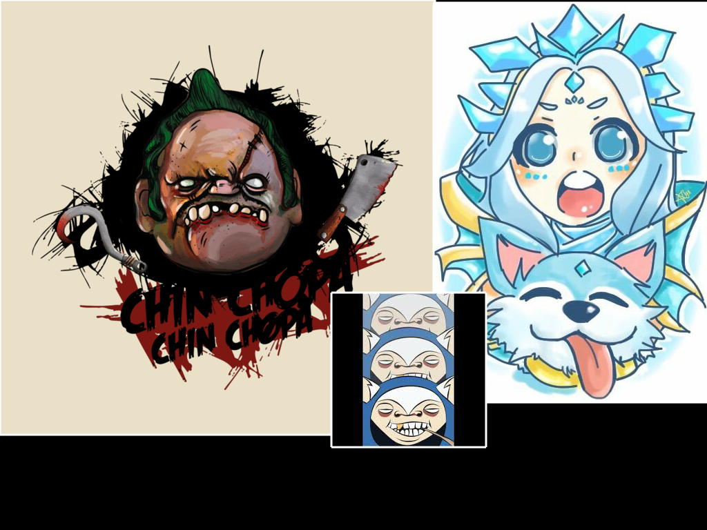

# the-manipulator

Author: [Sidharth Mishra](mailto:sidmishraw@gmail.com)

`the-manipulator` is a simple 2D direct manipulator for composing 2D images together to form a collage. It uses C++ and OpenFrameworks.

## Current capabilities of the tool

* The user is able to drag and drop multiple images into the Canvas and all images are displayed in the Canvas (concurrently).
  The images are stored in an associative array (map) with their corressponding depths (z-indexes). Lowest z-indexes are on the top – the last image dropped will overlay the previous.

* The user is able to select and de-select single images using their mouse pointer. The selected image should has a highlighted border (red color) to indicate that it is selected.

* The user is able to use the arrow keys (UP and DOWN) to move the order of the selected image in a stack of images.
  The UP key raises the level of the selected image and the DOWN key lowers it. There is no wrapping.

* User is able to grab and move selected image with the mouse and move with direct manipulation.

* Cmd + S (on MacOSx) and Ctrl + S (on Windows/Linux) save the image to an image file on the disk.

* 'X' + '+' : Translate +25 px on X axis

* 'X' + '-' : Translate -25 px on X axis

* 'S' + '+' : Scale +0.25

* 'S' + '-' : Scale -0.25

* 'R' + '+' : Rotate +15 degrees

* 'R' + '-' : Rotate -15 degrees

* Affordances for different modes of the manipulator. Affordances activate depending on the hitboxes.

## Changelog

### v 0.2.0

* Completed part 2 -- added Rotation, Scaling, and delete operations.

* Added hotkey support for constrained manipulation -- scaling, rotation, and translation.

### v 0.1.0

* Initial release -- satisfying part 1

## Image credits

[1] Pudge, Chin Chopa Chin Chopa – [Website](http://teehunter.com/2015/02/best-dota-2-heroes-t-shirts/)

[2] Meepo from google images - link not found (had it on my machine for a long time)

[3] Crystal maiden arcana fan art - [Website](https://hai-ru.deviantart.com/art/Crystal-Maiden-Arcana-547636674)
